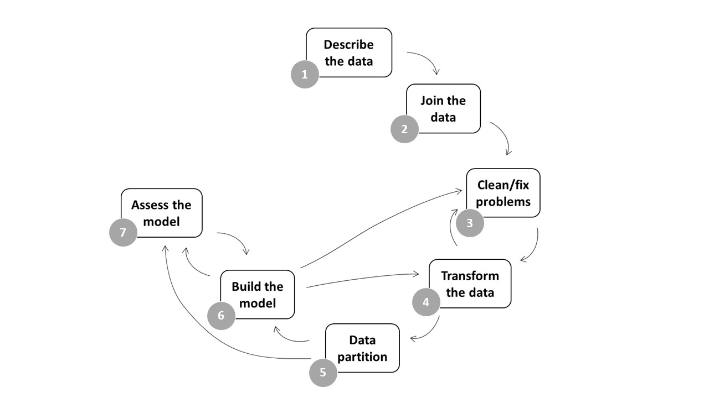

\pagebreak

```{r,include=FALSE, cache=FALSE}
library(knitr)
opts_chunk$set(tidy.opts=list(width.cutoff=60),tidy=TRUE)
```

```{r,echo=FALSE,message=FALSE,warning=FALSE}
require(knitr)
# Set so that long lines in R will be wrapped:
opts_chunk$set(tidy.opts=list(width.cutoff=80),tidy=TRUE)
```

# Introduction

The Cambridge English Dictionary [-@cambridge_business_english_dictionary_cambridge_2008] describes sales forecasting as "the statement of what the amount or value of a company's sales is likely to be in the future, based on information available now about the market, past sales, etc".

The increase of competition, complexity in business tasks, and the fact that nowadays circumstances, in general, tend to change more rapidly makes increasingly important for companies the use of forecasting technics for the prediction of their future prospects [@lancaster_forecasting_1985, p.1].

This report aims to describe, pre-process and analyse a set of data based on historical sales data collected from a nationwide retailer in the U.S and external factors, so as to lead to the development of an accurate predictive model. 

The methodology used is divided into 7 different steps, from describing the data to building and assessing the model developed (see figure 1). Notice that although each step is taken in order, the whole process has to be understood as a set of nested loops rather than a straight line.



The whole process has been done using the open software R and it is reproducible based on code.

This report is written as clearly and succinctly as possible, with the pretence that any person, without much prior knowledge in forecasting or in the R software, can understand it. For this purpose, the document describes not only the statistical process followed but also the code used with the software R to carry it out. 

# Data description

First of all, we install the packages needed for the project and activate their libraries.  

```{r message=FALSE, message=FALSE, warning=FALSE, cache=FALSE}
# Activate libraries
library(tidyverse)
library(VIM)
library(ggplot2)
library(dplyr)
library(psych)
library(lubridate)
library(caret)
library(car)
```

Secondly, we load the data into the R environment.

```{r, message=FALSE, cache=FALSE}
# Load data
stores = read_csv("data/stores.csv")
features = read_csv("data/features.csv")
train = read_csv("data/train.csv")
```

We are provided with 3 data sets (stores, features, and train) with the same format: comma-separated values (csv). 

Here is a brief description of each of them:

**stores.csv (45 obs. of 3 variables)**

- Store: the anonymised store number <numeric> 
- Type: store type, A: supercentre, B: superstore, C: supermarket <character>
- Size (sq ft): store size (in square feet) <numeric>

**features.csv (8,190 obs. of 12 variables)**

- Store: the anonymised store number <numeric>
- Date:	the week with the dated Friday <character>
- Temperature: average temperature in the region <numeric>
- Fuel_Price: cost of fuel in the region <numeric>
- Promotions:	anonymised data related to promotions, mainly price reductions  <numeric>
- CPI: the consumer price index <numeric>
- Unemployment: the unemployment rate <numeric>
- IsHoliday: whether the week is a special holiday week <boolean>

**train.csv (421,570 obs. of 5 variables)**

- Store: the anonymised store number <numeric>
- Department: the anonymised department number <numeric>
- Date: the week with the dated Friday <character>
- Weekly_Sales: sales for the given department in the given store <numeric>
- IsHoliday: whether the week is a special holiday week <boolean>

\pagebreak

Variables of each dataset have been explored through counts, summary statistics, crosstabulation and visualisations in order to identify potential inconsistencies or problems.

The main issues detected are briefly described below.

**1. Inconsistent data encoding**. In the stores' dataset, some stores might be wrongly classified. Two stores under 50,000 sq ft are coded as type B and other two as type A, when presumably small size stores (<50,000 sq ft) should be type C. 

```{r, include=FALSE, cache=FALSE}
# Crosstab Size and Type store data set
crosstab_Size_Type <- table(stores$Type, stores$`Size (sq ft)`)
# Print first 10 rows of mydata
head(crosstab_Size_Type, n=10)
```

**2. Missing values**. In the features dataset, 24,040 values are missing, almost 50% in the Promotions and 7% in the `CPI` and `Unemployment` variables. With the function of the VIM package `aggr()` we can visualise them for each variable alone and for each combination of variables. 

```{r , fig.cap=c("Missing values"), fig.height=3.5, fig.width=5.5, echo=TRUE, tidy=TRUE, tidy.opts=list(width.cutoff=60)}
# Plot missing values
aggr(features, prop=FALSE, col = "grey", cex.lab = 0.85, cex.axis = 0.65, 
     cex.main = 0.85)
```

**3. Negative values**. Promotions have some negative values (4 `Promotion1`, 25 `Promotion2`, 13 `Promotion3`, and 2 `Promotion5`); also `Weekly Sales` (1,286) in the train dataset.

**4. Data type errors**. The type of the `Date` variable is character instead of date in all datasets. This does not allow us to sort the datasets properly. Also in terms of type, it would be useful to have the variable IsHoliday in numeric (1 or 0) rather than in boolean (true or false). 

**5. Data not normally distributed**. The data in some variables is not normally distributed. `Weekly_Sales` is clearly left-skewed (see histogram below), `Size_(sq ft)` has a comb shape, and `Fuel_Price` and `CPI` are rather bimodal. 

```{r,include=FALSE, cache=FALSE}
# Scientific notation Off
options(scipen=999)
```

```{r, echo=TRUE, message=FALSE,fig.height=3.5, fig.width=5.5, fig.cap=c("Weekly Sales histogram"), tidy=TRUE, tidy.opts=list(width.cutoff=60)}
# Plot a histogram
ggplot(data=train, aes(train$Weekly_Sales)) + geom_histogram(aes(),color="black", alpha = 0.5) + labs(x="Weekly Sales", y="Frequency") + theme_classic() 
```

**6. Extreme values**. Finally, to mention that some variables have observations that could be considered as outliers or at least extreme values. This is analysed later, when the model is built.

```{r,include=FALSE, cache=FALSE}
# Scientific notation On
options(scipen=001)
```

# Data joining

The next step is to join the stores, train and features datasets in a single one. This allows us to make the analysis simpler and more straightforward. 

To performance the join, we use the function `left_join ()`. We chose this type of join because we want to end up having the same number of rows as the train dataset, which contains the response variable `Weekly_Sales` or variable to be forecast.  

First, we link the stores' dataset with the train one, using the common attribute `Store`; then we link the resultant dataset with the features dataset, using the common attributes `Store`, `Date` and `IsHoliday`. 

```{r, tidy=TRUE, tidy.opts=list(width.cutoff=60)}
# Join store-level data onto training dataset (so we know size and type)
data_joined = left_join(train, y= stores)
# Join train_joined onto features dataset (so we know the rest of variables)
data_joined = left_join(data_joined, y= features)
```

The result is a data frame with 421,570 observations of 16 variables. Notice that 1,755 observations did not match between the train and the features datasets. This is because the features dataset collects observations for a longer period than the train dataset, and with a left join, only the observations which match with the principal dataset (train) remain. 

# Cleaning and fixing problems with the data

In this section, we clean and fix all the inconsistencies or potential problems identified in the previous section data description. 

## Resolving inconsistent data encoding

It is assumed that the type of store is based on size and consequently, all stores under 50,000 sq ft are recoded as type C. This way, we solve the potential inconsistency detected in the description of the data.

```{r, tidy=TRUE, tidy.opts=list(width.cutoff=60)}
# Recode `stores$Type` based on `stores$Size (sq ft)`
data_joined$Type[(data_joined$`Size (sq ft)`<50000)] <- "C"
data_joined$Type[(data_joined$`Size (sq ft)`>=50000) 
& (data_joined$`Size (sq ft)` <150000)] <- "B"
data_joined$Type[(data_joined$`Size (sq ft)`>=150000)] <- "A"
```

## Dealing with missing values

There are two general approaches to deal with missing values: 

- deleting the cases containing missing data (listwise deletion), or 

- replacing them with reasonable alternative data values (missing data imputation) [@kabacoff_r_2011, p.353].

Deciding how we treat them will depend on the estimation of which approach will produce the most reliable and accurate results [@kabacoff_r_2011, p.354].

The amount of missing data is an important factor in this sense. There is no established cutoff from the literature regarding an acceptable percentage of missing data in a dataset for valid statistical inferences [@dong_principled_2013, p.2]. Schafer [-@schafer_multiple_1999, p.7] argues that a missing rate of 5% or less is inconsequential, while Bennett [-@bennett_how_2001, p.464] considers that more than 10% is likely to bias the statistical analysis.

In our case, given the high percentage of missing values in the promotion variables (around 50%), we opt for deleting them. 

The missing data detected in the `CPI` and `Unemployment` variables disappeared when the datasets were joined with the left_join.

\pagebreak

```{r}
# Delete Promotions
data_joined$Promotion1 <- NULL
data_joined$Promotion2 <- NULL
data_joined$Promotion3 <- NULL
data_joined$Promotion4 <- NULL
data_joined$Promotion5 <- NULL
```

## Negative values interpretation

We concluded that the negative values of the `Weekly_Sales` variable are returned products from previous weeks. So, no changes are done in this regard. On the other hand, the negative values in the Promotions are no longer a problem, as they have been deleted.

## Data type conversion

In order to make the variable `IsHoliday` more manageable, we convert its type into numeric using the generic function `as.numeric()`.

```{r}
# Convert IsHoliday to numeric
data_joined$IsHoliday <- as.numeric(data_joined$IsHoliday)
```

Also, the type of `Date` is transformed from character into date with the `mdy ()` function of the lubridate package.

```{r message=FALSE}
# Convert date info to date format 'dmy'
data_joined$Date <- dmy(data_joined$Date)
```

## Data distribution consideration<sup></sup>^[During the process of building the model, in an analysis exercise, the variables with non-normal distribution were normalised using a transformation log(x+1) [@hyndman_forecasting:_2017]. However, as explained above, the results of the model were worse and its interpretation more difficult. This step is not explained in detail here due to the word limitations of the report.]

To have the errors normally distributed is often useful for the multiple linear regression analysis (the forecasting technique we apply to build the model), however, in our case, the normalization of the skewed variables performanced while building the model did not improve the model, on the contrary, it made it more complicated and difficult to understand. Consequently, we have decided to keep them the way they are.   

## Extreme values analysis<sup></sup>^[During the process of building the model, extremes values were analysed using a multivariate model approach, but removing them did not influence on the results of the model. So, we opted for considering them normal values and keep them in the model dataset. This step is not explained in detail either due to the word limitations of the report]

Extreme values were analysed but cleaning them did not improve the results of the model either, so, no changes have been done in this regard.

# Data transformation

Once the data inconsistencies or potential problems are fixed, some transformations are carried out in order to prepare the dataset for the construction of the model.

First, we create a week number of year column in order to compare them.

```{r}
# Create a week number of the year variable
data_joined$WeekNum <- as.numeric(format(data_joined$Date+3,"%U"))
```

Secondly, we extract a year column from the date variable.

```{r}
# Create a year variable
data_joined$year = lubridate::year(data_joined$Date)
```

Finally, we generate a variable of the previous year's Weekly Sales, a variable that as Zoltners et al argue [-@zoltners_complete_2001, p.342], can be a very powerful predictor for forecasting next year's sales. 

```{r, echo=TRUE, message=FALSE, fig.cap=c("Correlation Weekly Sales ~ Weekly Sales"), fig.height=3.5, fig.width=5.5, tidy=TRUE, tidy.opts=list(width.cutoff=60)}
# Create a previous year's Weekly Sales dataset
prevyear = select(data_joined, year, WeekNum, Dept, Store, 
prev_Weekly_Sales =  Weekly_Sales) 
prevyear$year = prevyear$year + 1
# Join it with the data_joined dataset
data_joined = left_join(data_joined, prevyear)
```

And as it can be seen in Figure 4, the correlation between both variables is indeed very high.

```{r, echo=TRUE, fig.cap=c("Correlation Weekly Sales ~ Previous year Weekly Sales"), fig.height=3.5, fig.width=5.5, message=FALSE, warning=FALSE, tidy=TRUE, tidy.opts=list(width.cutoff=60)}
# Scatter plot Weekely Sales ~ Previous Year Weekly Sales
ggplot(data_joined, aes(x=Weekly_Sales, y=prev_Weekly_Sales)) + geom_point(color="grey") + labs(title=NULL, x="Weekly Sales", y = "Previous year Weekly Sales") + theme_classic() 
```

A problem that arises with this new variable is that because it is based on sales of a previous year, it has a year of missing values. We handle this applying again listwise deletion, in other words, deleting all the rows of the dataset in which there are missing values. This will reduce the sample size by 38% (from 421,570 to 261,541) which could reduce statistical power of our model dataset. However, an approach with the entire dataset could bias the results of the subsequent analysis [@bennett_how_2001, p.464].

```{r, cache=FALSE}
# Delete rows with NA's
data_joined = na.omit(data_joined)
```

```{r, include=FALSE, cache=FALSE}
# Reorganise the columns
data_joined <- data_joined[c(2,1,6,7,3,8,9,10,11,12,5,4,14)]
```

```{r, include=FALSE, cache=FALSE}
# Glance at the first 6 rows of the model dataset
head(data_joined)
```

# Data partition

In this section, we divide the model dataset into two parts. The training set with the 80% of the observations which will be used to build the model (data_joinedT); and the validation set with the remaining 20% which will be used to adjust it (data_joinedV). 

For the partition, we use the `caret` package and the following code:

```{r, message=FALSE}
# Subset the data into train and validation
n = nrow(data_joined)
trainIndex = sample(1:n, size = round(0.8*n), replace=FALSE)
data_joinedT = data_joined[trainIndex ,]
data_joinedV = data_joined[-trainIndex ,]
```

# Building the model

To build the model, we first choose the forecasting technique, then analyse which variables can be more influential for the prediction, and finally, we obtain a specific model, which best explains how sales will be in the future.

## The choice of forecasting technique

The choice of forecasting technique is a major consideration. There are many different methods to apply, from pure guesswork to highly complex mathematical analysis [@lancaster_forecasting_1985, p.15]. Three factors are determinant in the decision: accuracy, time-scale and cost [@lancaster_forecasting_1985, pp.37-38].

In this case, we opt for a multiple simple regression approach due to two fundamental reasons:

- it is the most understandable and accessible technique, and;

- it is quicker and cheaper as well.

Multiple linear regression is described as a statistical technique for predicting a quantitative response (or dependent) variable from two or more explanatory (or independent) variables [@kabacoff_r_2011, p.175].

Its general form is:

$${y_i} = {B}_0 + {B}_1{x}_1,_i + {B}_2{x}_2,_i+...+ {B}_k{x}_k,i + {e}_i,$$

Where,

- *y~i~* is the response or dependent variable 
- *x~i~,~i~...+ x~k~,~i~* are the explanatory or independent variables 
- *B~0~* is the y-intercept
- *B~1~,...B~k~* are the coefficients that measure the marginal effects of the predictors
- *e~i~* are the residuals (a random variable that captures the fact that regression models typically do not fit the data perfectly).

In our model, `Weekly_Sales will be the response or dependent variable that has to be forecast, and the rest of columns the explanatory or independent variables that potentially will help on the prediction.

## The selection of the explanatory variables

To build the model we use the training data set data_joinedT and perform a stepwise selection of variables by backwards elimination. This means we start fitting the model with all the candidate variables and drop progressively those which are not suitable or do not contribute to the sales prediction.

To fit the model we use the generic function `lm ()` and then we show the output using `summary()`.

```{r, tidy=TRUE, tidy.opts=list(width.cutoff=60)}
# Fit the model (1)
fit <- lm (Weekly_Sales ~ IsHoliday + Type + `Size (sq ft)`+ prev_Weekly_Sales + Temperature + Fuel_Price + CPI + Unemployment, data= data_joinedT)
summary(fit)
```

At first glance, we can see that the full model fits well:

- all predictors have a highly significant p-value (three stars), which indicates that their relationship with the response variable might be significant, 

- the R-squared is very high, which explains how well the model is fitting the actual data, and;

- the F-statistic is very far from zero, which tell us that there might be a strong relationship between the predictors and the response variable.

However, additional tests are needed to observe if all the explanatory variables are actually good or contributing to the prediction, in other words, to optimise and make the model simpler and more accurate. 

### Multiple collinearity

First, we need to check if among the explanatory variables there is collinearity. To find it out, we use the basic function `vif ()`. If the Gvif value is around 1 there is no correlation, if it is between 1 and 5 there is a moderate correlation, and if it is over 5 the correlation is high or very high.

```{r}
# Calculate the Variance Inflation Factor
vif(fit)
```

As we can see from the results, there is a high collinearity between `Type` and `Size (sq ft)`, which makes sense as the type of stores must be based on their Size. So, we drop the variable `Type`, and then refit the model and check the output.

\pagebreak

```{r, tidy=TRUE, tidy.opts=list(width.cutoff=60)}
# Refit the model (2) - drop Type
fit <- lm (Weekly_Sales ~ IsHoliday + `Size (sq ft)`+ prev_Weekly_Sales + Temperature + Fuel_Price + CPI + Unemployment, data= data_joinedT)
summary(fit) 
```

The R-squared lowered slightly, but the F-statistic is even higher.

If we check the vif again, we can see that this time all the variables are around 1, since, with the elimination of the Type variable, the high value of `Size (sq ft)` went down to normal.

```{r}
# Recalculate the Variance Inflation Factor (2)
vif(fit)
```

\pagebreak

### Influence on R-squared and F-statistic

Although all variables have a good p-value, they can contribute differently to the prediction. In fact, after carrying out a set of model fittings, we concluded that the variables `IsHoliday`, `Temperature`, `Fuel_Price` and `CPI` do not contribute to the prediction at all. 

When we look at the summary of the model fitted without them, the results of R-squared and p-values do not go any worse, and in addition, the F-statistics grows more than twice.

```{r, tidy=TRUE, tidy.opts=list(width.cutoff=60)}
# Refit the model (3) - drop `IsHoliday`, `Temperature`, `Fuel_Price` and `CPI`
fit <- lm(Weekly_Sales ~ `Size (sq ft)`+ prev_Weekly_Sales + Unemployment, data= data_joinedT)
summary(fit)
```

When we drop Unemployment or/and Size and refit the model, the R-squared decrease slightly, however, the F-statistic goes up. So, our interpretation is that these two explanatory variables neither are influential.

```{r, echo=TRUE, message=FALSE, warning=FALSE, cache=FALSE, list(width.cutoff=60), tidy=TRUE, tidy.opts=list(width.cutoff=60)}
# Refit the model (4) - drop Unemployment and Size
fit <- lm(Weekly_Sales ~ prev_Weekly_Sales, data= data_joinedT)
#R2 = 96,71%, p-value = < 2.2e-16, F-statistic:  6.175e+06
```

\pagebreak

## The final model

In conclusion, with the information we have available, the most optimal model for the prediction of sales that we can achieve is a simple linear regression between the explanatory derived variable `prev_Weekly_Sales` and the response variable `Weekly_Sales`.

```{r, tidy=TRUE, tidy.opts=list(width.cutoff=60)}
# The final model
fit <- lm(Weekly_Sales ~ prev_Weekly_Sales, data= data_joinedT)
#R2 = 96,71%, p-value = < 2.2e-16, F-statistic:  6.175e+06
```

# Model assessment

For the assessment of the model, first, we calculate with the generic function `predict ()´ the predicted Weekly Sales for both, the training set (data_joinedT) and the validation set (data_joinedV).

```{r, tidy=TRUE, tidy.opts=list(width.cutoff=60)}
# Find predicted values for both the training set and the validation
data_joinedT$Pred.Weekly_Sales <- predict(fit, 
    newdata = subset(data_joinedT, select=c(Weekly_Sales,  prev_Weekly_Sales)))
data_joinedV$Pred.Weekly_Sales <- predict(fit, 
    newdata = subset(data_joinedV, select=c(Weekly_Sales,  prev_Weekly_Sales)))
```

Then, we measure the model's accuracy calculating the Weighted Mean Absolute Error (WMAE) with the following formula:

$$WMAE = \frac{1}{\sum{W}i}\sum_{i=1}^N{W}i\left\lvert{y_{i}-\hat{y}_{i}}\right\rvert$$
Where, 

- *N* is the total number of data rows in the validation data file,
- *y~i~* is the actual sales,
- *y^~i~* the predicted sales,
- *W~i~* are weights (*W~i~* = 5 if the week is a holiday week, otherwise *W~i~* =1)

To weight the errors, we create dummy variables considering if it is or not a holiday week.

```{r, echo=TRUE, message=FALSE, warning=FALSE, tidy=TRUE, tidy.opts=list(width.cutoff=60)}
# Create Error variable
data_joinedT$Error <- c(data_joinedT$Weekly_Sales - data_joinedT$Pred.Weekly_Sales)
data_joinedV$Error <- c(data_joinedV$Weekly_Sales - data_joinedV$Pred.Weekly_Sales) 
# Create dummy variebles with weights
data_joinedT$Dummy[data_joinedT$IsHoliday<1]<-1
data_joinedT$Dummy[data_joinedT$IsHoliday>=1]<-5
data_joinedV$Dummy[data_joinedV$IsHoliday<1]<-1
data_joinedV$Dummy[data_joinedV$IsHoliday>=1]<-5
# Create Weight Error variable W
data_joinedT$W <- data_joinedT$Dummy*data_joinedT$Error
data_joinedV$W <- data_joinedV$Dummy*data_joinedV$Error
```

Finally, we calculate the WMAE in each dataset. 

```{r echo=TRUE, message=FALSE, warning=FALSE, tidy=TRUE, tidy.opts=list(width.cutoff=60)}
# Check how good is the model on the training set - WMAE
train.WMAE <- round(mean(abs(data_joinedT$W)))
c(train.WMAE)
```

```{r echo=TRUE, message=FALSE, warning=FALSE, tidy=TRUE, tidy.opts=list(width.cutoff=60)}
# Check how good is the model on the validation set - WMAE
valid.WMAE <- round(mean(abs(data_joinedV$W)))
c(valid.WMAE)
```

In both cases, the WMAE is around $2,500, a figure that can be considered low - taking into account the scale of the variable.

Therefore, we could conclude that we managed to build a simple but rather accurate model to predict sales.

# Conclusions

This report describes, preprocesses and analyses a set of external and internal data related to a nationwide retailer from the United States, so as to lead to the development of an accurate sales predictive model.

The conclusions reached with the interpretation of the model are as follows:

- From all the information available, the only sales predictor, although very powerful, is the sales of the previous year.
- Contrary to our expectations, the size of stores does not seem to be influential.
- The same conclusion is drawn regarding the external factors provided.

In short, the model essentially says that although sales might vary over time, this variation must be smooth and for some reason not explained for the other predictors. So, in the absence of other information, this year's sales should be the same as they were the previous one.  

# References
